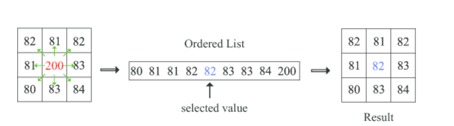

== GÖRÜNTÜ İŞLEME Medyan Filtre

== 1)İçindekiler
. İçindekiler +
. Versiyon Geçmişi +
. Giriş +
. Medyan Filtre Yöntemi +
. Python ile Medyan Filtre Uygulama Örneği +
. Referanslar +

== 2) Versiyon Geçmişi +
|===
|Tarih|Değişiklik|Kişi

|01.11.2016
|Medyan Filtre 

|Miraç Sıla GENÇ
|04.11.2016

|Medyan Filtre Örneği
|Gönül TOKTAY

|13.12.2016
|Düzenleme
|Merve Tafralı
|===

== 3) Giriş +

Medyan filtresi görüntü işlemede çok sık kullanılan filtredir. Görüntülerde gürültü adı verilen, istenmeyen sinyaller bulunmaktadır. 
Gürültü, görüntüyü kirleten ve görüntü kalitesini düşüren harici kaynaklarda oluşan etkidir. Gürültü bir görüntü içerisinde bir çok 
farklı kaynaklardan meydana gelebilir. Filtreleme   yöntemleri sayesinde görüntüler gürültüden arındırılarak istenilen hale getirilebilir. +

Filtreleme yöntemi görsel üzerinde uygulanılacaktır. Uygulama sırasında hangi işlemlerin yapıldığı, filtrenin seçimi ve aşamalar anlatılacaktır. 
Uygulamanın Python dilinde kodlamasında gerçekleştirilecektir. +

== 4) Medyan Filtreleme Yöntemi +

Medyan filtresi gürültü temizlemek, görüntüyü keskinleştirmek için en sık kullanılan algoritmalardan biridir. Medyan filtreleme 
doğrusal bir işlem değildir. Medyan filtresinde, ilk olarak NxN’lik bir matris kullanılarak değerler küçükten büyüğe sıralanır. 
Daha sonra ortanca değer merkezde bulunan değerin yerine yazılır. Bu işlem soldan sağa tüm sütunlar için gerçekleştirildikten sonra
(Şekil 2.1) her satır için gerçekleştirilmeye devam eder. +

Şekil: 2.1
