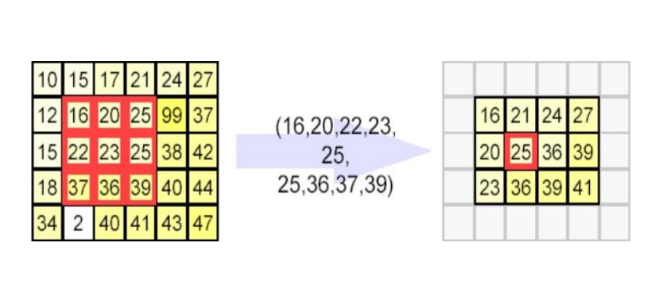

== GÖRÜNTÜ İŞLEME Medyan Filtre

== 1)İçindekiler
. İçindekiler +
. Versiyon Geçmişi +
. Giriş +
. Medyan Filtre Yöntemi +
. Python ile Medyan Filtre Uygulama Örneği +
. Referanslar +

== 2) Versiyon Geçmişi +
|===
|Tarih|Değişiklik|Kişi

|01.11.2016
|Medyan Filtre 

|Miraç Sıla GENÇ
|04.11.2016

|Medyan Filtre Örneği
|Gönül TOKTAY

|13.12.2016
|Düzenleme
|Merve Tafralı
|===

== 3) Giriş +

Medyan filtresi görüntü işlemede çok sık kullanılan filtredir. Görüntülerde gürültü adı verilen, istenmeyen sinyaller bulunmaktadır. 
Gürültü, görüntüyü kirleten ve görüntü kalitesini düşüren harici kaynaklarda oluşan etkidir. Gürültü bir görüntü içerisinde bir çok 
farklı kaynaklardan meydana gelebilir. Filtreleme   yöntemleri sayesinde görüntüler gürültüden arındırılarak istenilen hale getirilebilir. +

Filtreleme yöntemi görsel üzerinde uygulanılacaktır. Uygulama sırasında hangi işlemlerin yapıldığı, filtrenin seçimi ve aşamalar anlatılacaktır. 
Uygulamanın Python dilinde kodlamasında gerçekleştirilecektir. +

== 4) Medyan Filtreleme Yöntemi +

Bahsedildiği üzere medyan filtresi en çok tercih edilen algoritmaların başında yer alır ve lineer bir işlem değildir. +

Medyan filtreler nonlineer uzaysal filtrelerdir. Maskeyi oluşturan boyuttaki resim piksel değerlerinin küçükten büyüğe sıralanıp ortadaki değeri merkez piksele atama işlemidir.Medyan filtresi bir alçak geçiren filtredir. +

Mean filtrelerinin genel çalışma mantığı ise; NxN lik bir matris penceresi içerisinde bir ortalama değer bulmaya çalışarak işlenir. 
Bunu yaparken görüntü üzerinde gezen bir kayan pencere yöntemi kullanırlar. Medyan filtresi mean filtreleri içerisinde en basit olanıdır. Pencere içerisindeki değerlerin aritmetik ortalamasını alır ve bu şekilde büyük atlamaları kaldırmış olur. Filtre uygulandıktan sonra; konumlarından ayrılmış olan pikseller tespit edilerek temizlenmiş olur. Görüntü içerisindeki yerel değişimleri yumuşatmış olur. Sırada medyan filtresinin gerçekleştirdiği işlemler anlatılacaktır. +

Medyan filtresi için örnek olarak alınan değerler sırasıyla şunlar olsun: +

996, 1718, 1002, 993, 1692, 1003 +
Alınan bu sayıları  3’erli gruplayalım(window size=3 alındı): +

*1.grup:* [996 996 1718]  +
→ Burada 996 sayısının 2 kere kullanılmasının sebebi     window size’ın 3 olarak belirlenmiş  olmasıdır.
1.grup için medyan=996 O halde 1. Sayı 996’dır. +
*2.grup:*[ 996, 1718, 1002] +
Sıralanırsa: 996 1002 1718 +
Bu grup için medyan değeri=1002dir. 2.sayı da 1002 olmuş oldu. +
*3.grup:*[ 1718, 1002, 993] +
Sıralama işleminin ardından medyan değeri=1002. Üçüncü sayı 1002 olmuştur. +
*4.grup:*[1002 993 1693] +
4.grubun medyanı=1002 bulundu. 4. Sayı=1002 +
*5.grup:*[ 993, 1692, 1003 ] +
Üç sayının medyanı 1003 dür. O halde beşinci sayının yeni değeri 1003 dür. +
*6. grup:* [1692 1003 1003] +
6.grubun medyan değeri. 1003 dür. O halde son sayının yeni değeri 1003 olmuştur. +
Buna göre ilk başta verilmiş olan; 996 1718 1002 993 1692 1003 sayılarının yeni değerleri sırayla aşağıdaki gibi olmuştur. +
 996  1002  1002  1002 1003 1003  +
Yeni elde ettiğimiz değerlerden anlaşılacağı gürültüden kaynaklı 1718 ve 1692 sayıları kaybolmuştur. Yeni değerlerin ortalaması ise 1001,3 dür. +
Değerler; ortanca filtre kullanılmadan önce ortalama 1234 idi. Ortanca filtresi kullanımından sonra 1001,3 olmuştur. +
Medyan filtreyi bir görselle de ifade edecek olursak, aşağıda paylaşılan görsel incelenebilir. +

== 5)Python ile Medyan Filtre Uygulama Örneği +

[[source,python]]
----

import Image
im=Image.open("C:\Users\MERVE\Pictures\out2.jpg")
pix=im.load()
w=im.size[0]
h=im.size[1]
graylist=[[0]*h for x in range(w)]
temparray=[[0]*(h+2) for x in range(w+2)]
for i in range(w):
    for j in range(h):       
        r, g, b = im.getpixel((i, j))
        print r,g,b,
        gray=(int)((r*0.2126)+(g*0.7152)+(b*0.0722))
        graylist[i][j]=gray
        pix[i,j]=(gray,gray,gray)
for ni in range (1,w+1):
    for nj in range(1,h+1):        #Görüntüyü matris içerişine çekebilmek için iç içe döngüler kullanıyoruz. Döngüde sınır değerlerimiz görüntünün genişlik ve yükseklik değerine göre ayarlandı. +                      
        temparray[ni][nj]=graylist[ni-1][nj-1]
med=([0]*9)                        #Burada members adında 3x3’lük bir matris oluşturuyoruz. Ve ilk değeri “0” olarak atanmıştır +
gecici=0
for m in range(1,w+2-1):
    for n in range(1,h+2-1):
        med[0]=temparray[m-1][n-1]
        med[1]=temparray[m-1][n]
        med[2]=temparray[m-1][n+1]
        med[3]=temparray[m][n-1]
        med[4]=temparray[m][n]
        med[5]=temparray[m][n+1]
        med[6]=temparray[m+1][n-1]
        med[7]=temparray[m+1][n]
        med[8]=temparray[m+1][n+1]
        med=sorted(med)
        value=med[4]
        pix[m-1,n-1]=(value,value,value)
im.save("C:\Users\MERVE\Pictures\out2medyan.bmp")

----

image::out2.jpg[Uygulama] 

image::out2medyan.bmp[Sonuç]

* print im.getpixel ((3,5))  yazarak debug yapabilirsiniz. +

[[source,python]]
----
from PIL import Image 	                                 #PIL kütüphanesinden Image kütüphanesini projeye   dahil ediyoruz.
resim=Image.open("resim.jpg") 	                         #Projemizin olduğu dosya klasörünün içinde bulunan resim dosyasını açıyoruz.
yuklenen = resim.load()	                                #resim dosyasını yüklenen adında matrise atıyoruz.
genislik=resim.size[0] 	                                #resim dosyasının ilk elemanını genişlik değişkeninine atıyoruz.
yukseklik=resim.size[1] 	                               #resim dosyasının ikinci elemanını yükseklik değişkenine atıyoruz.
graylist=[[0]*yukseklik for x in range(genislik)] 	     #graylist adında bir matris tanımladık. Bu matrisin boyutu resim dosyasının yükseklik ve genişlik değerinden aldık.
for i in range(genislik): 	                             # İç içe döngü oluşturduk ve görüntünün değerlerini matrise atadık.
    for j in range(yukseklik):
        r, g, b = resim.getpixel((i, j)) 	              #resim dosyasının her pixelinin renk kodları sayısal değer olarak r, g, b değişkenlerine atanır.
        gray=(int)((r*0.2126)+(g*0.7152)+(b*0.0722))    # Resim görüntüsünün kırmızı, yeşil, mavi renklerinin değerlerine uygun kodlar verilerek gri renk elde edilebilir. Burada verdiğimiz değerler bu renk kodlarının gri halini ortaya koyacaktır. Bulunan sayısal değer gray değişkenine atanır.
        graylist[i][j]=gray	                            #gray değişkeni graylist matrisinin tüm elemanlarına atanır.
        yuklenen[i,j]=(gray,gray,gray) 	                #Yüklediğimiz resmin elemanları olan piksellerine gray değişkeninde ki sayısal değer atanacaktır. 3 ayrı gray değişkeni atılmasının nedeni ise r,g,b şeklinde üç kod bulunmaktadır. Ağırlık toplama yöntemi ile hesaplanan gri renk tonu ataması yapılır.

resim.save("yeni.jpg")	                                 #Görüntüyü proje dosyasının içine kaydediyoruz.
grayimage=Image.open("yeni.jpg") 	                      #Aynı görüntüyü farklı bir değişken içine atarak tekrar açıyoruz.
median=grayimage.load() 	                               #Görüntüyü median matrisinin içerisine sayısal değerler olarak yüklüyoruz.
 w=grayimage.size[0]	                                   #grayimage görüntüsünü genişliği w değişkenine atanır. Burada görüntümüzün genişliği 640 pixel.

h=grayimage.size[1] 	                                   #grayimage görüntüsünü yüksekliği w değişkenine atanır. Burada görüntümüzün yüksekliği 360 pixel.
 
members=([0]*9)	                                        #Burada members adında 3x3’lük bir matris oluşturuyoruz. Ve ilk değeri “0” olarak atanmıştır.
 
for x in range (1,w-1):	                                #Görüntüyü matris içerişine çekebilmek için iç içe döngüler kullanıyoruz. Döngüde sınır değerlerimiz görüntünün genişlik ve yükseklik değerine göre ayarlandı.
 
    for y in range (1,h-1):
        members[0]=graylist[x-1][y-1]                  	#members matrisinin [0]. elemanının içerisine graylist matrisinin [0,0] elemanı atandı.
 
        members[1]=graylist[x][y-1]	                    #members matrisinin [1]. elemanının içerisine graylist matrisinin [1,0] elemanı atandı.
 
        members[2]=graylist[x+1][y-1]	                  #members matrisinin [2]. elemanının içerisine graylist matrisinin [2,0] elemanı atandı.
 
        members[3]=graylist[x-1][y]	                    #members matrisinin [3]. elemanının içerisine graylist matrisinin [0,1] elemanı atandı.
 
        members[4]=graylist[x][y]	                      #members matrisinin [4]. elemanının içerisine graylist matrisinin [1,1] elemanı atandı.
 
        members[5]=graylist[x+1][y]	                    #members matrisinin [5]. elemanının içerisine graylist matrisinin [2,1] elemanı atandı.
 
        members[6]=graylist[x-1][y+1]	                  #members matrisinin [6]. elemanının içerisine graylist matrisinin [0,2] elemanı atandı.
 
        members[7]=graylist[x][y+1]                     #members matrisinin [7]. elemanının içerisine graylist matrisinin [1,2] elemanı atandı.
 
        members[8]=graylist[x+1][y+1]	                  #members matrisinin [8]. elemanının içerisine graylist matrisinin [2,2] elemanı atandı.
 

        members.sort()	                                 #members matrisini sort fonksiyonunu kullanarak sıralıyoruz. Böylece matristeki tüm değerleri sıralamış oluyoruz. Bu sayede medyan filtresi mantığındaki gibi ortadaki değeri çekebiliriz.
 
        med=members[(len(members))/2]	                  #Burada sıralanmış olan matrisimizin uzunluğunu ikiye bölerek ortanca değerini yani medyan değerini çekiyoruz ve med değişkeni içine atıyoruz.
 
        median[x,y]=(med,med,med)	                      #median görüntüsünün tüm indislerine bulduğumuz med ortanca değerindeki sayısal değeri atıyoruz.

grayimage.save("yeni1.jpg") 	                           #Görüntüyü proje dosyası içerisine kaydediyoruz.

grayimage.show()	                                       #Görüntüyü ekrana basıyoruz.

----

Görüntünün ilk hali +
image::m1normal.png[normal]

Görüntünün Ağırlık Toplama işleminden sonraki hali +
image::m1agırlık.pngp[Sonuç]

Görüntünün Medyan Filtre işleminden geçmiş hali+
image::m1medyan.png[Medyan]

== 6) Referanslar +

. http://www.bulentsiyah.com/goruntu-filtreleme-uygulamalari-ve-amaclari-matlab/
. http://bilgisayarkavramlari.sadievrenseker.com/2007/11/26/ortanca-filitresi-median-filter/
. http://web.firat.edu.tr/iaydin/bmu357/bmu_357_bolum5.pdf
. http://www.programming-techniques.com/2013/02/median-filter-using-c-and-opencv-image.html
. http://stackoverflow.com/questions/6944150/otsus-method-and-a-median-filter-in-python?rq=1
