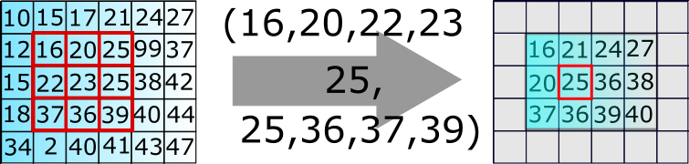

== GÖRÜNTÜ İŞLEME Medyan Filtre

== 1)İçindekiler
. İçindekiler +
. Versiyon Geçmişi +
. Giriş +
. Medyan Filtre Yöntemi +
. Referanslar +

== 2) Versiyon Geçmişi +
|===
|Tarih|Değişiklik|Kişi

|01.11.2016
|Medyan Filtre 

|Miraç Sıla GENÇ
|04.11.2016

|Medyan Filtre Örneği
|Gönül TOKTAY

|13.12.2016
|Düzenleme
|Merve Tafralı
|===

== 3) Giriş +

Medyan filtresi görüntü işlemede çok sık kullanılan filtredir. Görüntülerde gürültü adı verilen, istenmeyen sinyaller bulunmaktadır. 
Gürültü, görüntüyü kirleten ve görüntü kalitesini düşüren harici kaynaklarda oluşan etkidir. Gürültü bir görüntü içerisinde bir çok 
farklı kaynaklardan meydana gelebilir. Filtreleme   yöntemleri sayesinde görüntüler gürültüden arındırılarak istenilen hale getirilebilir http://www.bulentsiyah.com/goruntu-filtreleme-uygulamalari-ve-amaclari-matlab/[[1]] . +

Filtreleme yöntemi görsel üzerinde uygulanılacaktır. Uygulama sırasında hangi işlemlerin yapıldığı, filtrenin seçimi ve aşamalar anlatılacaktır. 
Uygulamanın Python dilinde kodlamasında gerçekleştirilecektir. +

== 4) Medyan Filtreleme Yöntemi +

Bahsedildiği üzere medyan filtresi en çok tercih edilen algoritmaların başında yer alır ve lineer bir işlem değildir. +

Medyan filtreler nonlineer uzaysal filtrelerdir. Maskeyi oluşturan boyuttaki resim piksel değerlerinin küçükten büyüğe sıralanıp ortadaki değeri merkez piksele atama işlemidir.Medyan filtresi bir alçak geçiren filtredir. +

Mean filtrelerinin genel çalışma mantığı ise; NxN lik bir matris penceresi içerisinde bir ortalama değer bulmaya çalışarak işlenir. 
Bunu yaparken görüntü üzerinde gezen bir kayan pencere yöntemi kullanırlar. Medyan filtresi mean filtreleri içerisinde en basit olanıdır. Pencere içerisindeki değerlerin aritmetik ortalamasını alır ve bu şekilde büyük atlamaları kaldırmış olur. Filtre uygulandıktan sonra; konumlarından ayrılmış olan pikseller tespit edilerek temizlenmiş olur. Görüntü içerisindeki yerel değişimleri yumuşatmış olur. Sırada medyan filtresinin gerçekleştirdiği işlemler anlatılacaktır. +

Medyan filtresi için örnek olarak alınan değerler sırasıyla şunlar olsun: http://bilgisayarkavramlari.sadievrenseker.com/2007/11/26/ortanca-filitresi-median-filter/[[2]] +

996, 1718, 1002, 993, 1692, 1003 +
Alınan bu sayıları  3’erli gruplayalım(window size=3 alındı): +

*1.grup:* [996 996 1718]  +
→ Burada 996 sayısının 2 kere kullanılmasının sebebi     window size’ın 3 olarak belirlenmiş  olmasıdır.
1.grup için medyan=996 O halde 1. Sayı 996’dır. +
*2.grup:*[ 996, 1718, 1002] +
Sıralanırsa: 996 1002 1718 +
Bu grup için medyan değeri=1002dir. 2.sayı da 1002 olmuş oldu. +
*3.grup:*[ 1718, 1002, 993] +
Sıralama işleminin ardından medyan değeri=1002. Üçüncü sayı 1002 olmuştur. +
*4.grup:*[1002 993 1693] +
4.grubun medyanı=1002 bulundu. 4. Sayı=1002 +
*5.grup:*[ 993, 1692, 1003 ] +
Üç sayının medyanı 1003 dür. O halde beşinci sayının yeni değeri 1003 dür. +
*6. grup:* [1692 1003 1003] +
6.grubun medyan değeri. 1003 dür. O halde son sayının yeni değeri 1003 olmuştur. +
Buna göre ilk başta verilmiş olan; 996 1718 1002 993 1692 1003 sayılarının yeni değerleri sırayla aşağıdaki gibi olmuştur. +
 996  1002  1002  1002 1003 1003  +
Yeni elde ettiğimiz değerlerden anlaşılacağı gürültüden kaynaklı 1718 ve 1692 sayıları kaybolmuştur. Yeni değerlerin ortalaması ise 1001,3 dür. +
Değerler; ortanca filtre kullanılmadan önce ortalama 1234 idi. Ortanca filtresi kullanımından sonra 1001,3 olmuştur. +
Medyan filtreyi bir görselle de ifade edecek olursak, aşağıda paylaşılan görsel incelenebilir http://web.firat.edu.tr/iaydin/bmu357/bmu_357_bolum5.pdf[[3]]. +

 

== 5)Python ile Medyan Filtre Uygulama Örneği +

Python ile medyan filtre uygulama örneği http://www.programming-techniques.com/2013/02/median-filter-using-c-and-opencv-image.html[[4]] .

[TIP]
====
Daha anlaşılabilir olması için "tuz biber örnekleri"ni internette aratabilirsiniz.

====

Resmin Orjinal Hali +

1. Adım +

Son Adım +

image::m1medyan.png[Medyan]

== 6) Referanslar +

. http://www.bulentsiyah.com/goruntu-filtreleme-uygulamalari-ve-amaclari-matlab/
. http://bilgisayarkavramlari.sadievrenseker.com/2007/11/26/ortanca-filitresi-median-filter/
. http://web.firat.edu.tr/iaydin/bmu357/bmu_357_bolum5.pdf
. http://www.programming-techniques.com/2013/02/median-filter-using-c-and-opencv-image.html
. http://stackoverflow.com/questions/6944150/otsus-method-and-a-median-filter-in-python?rq=1
